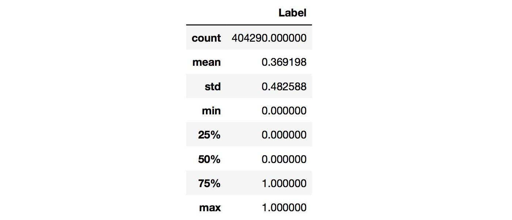
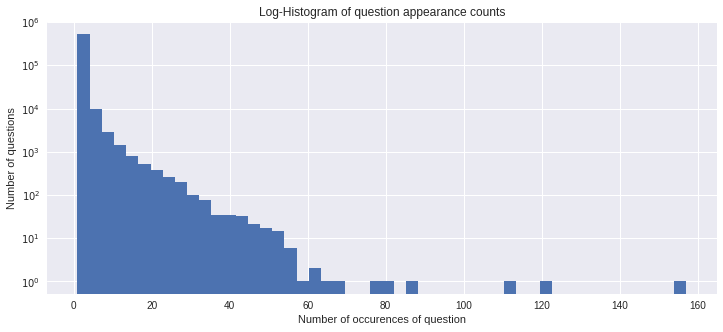
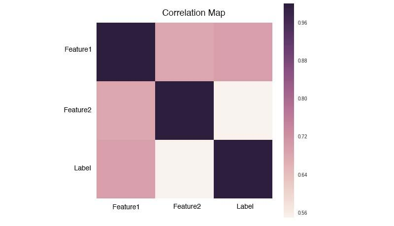
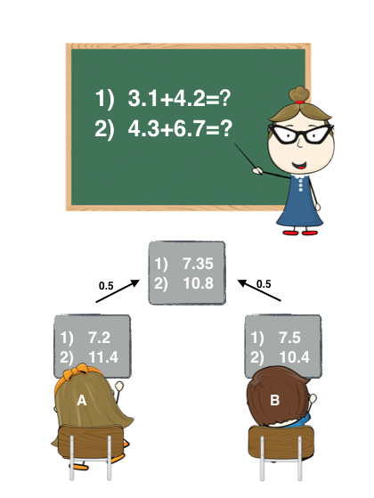
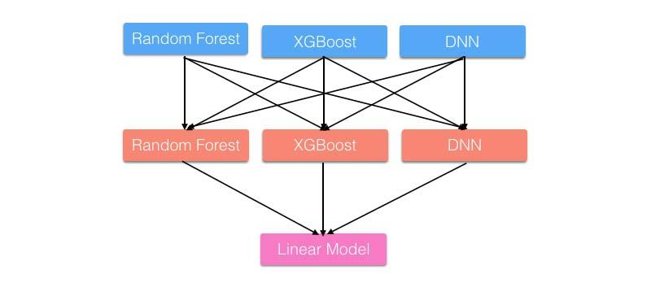
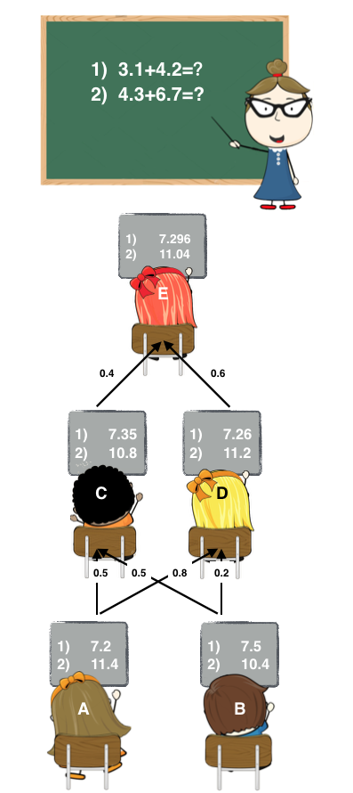

### 1. Competition Guide

For convenience, let’s first define a few terms:

- **Feature**: A feature variable, also called an independent variable. These are observable attributes of a sample and are typically used as model inputs.
- **Label**: Also called the target variable. This is the variable we aim to predict—usually the model’s output.
- **Train Data**: Labeled data provided by the organizers.
- **Test Data**: Unlabeled data used for final scoring in the competition, also provided by the organizers.
- **Train Set**: A subset of the train data used for training the model (commonly used in cross-validation).
- **Valid Set**: A subset of the train data used for model validation (also commonly used in cross-validation).

#### 1.1 Understanding the Problem

The first step after receiving a competition task is to break it down and translate it into a corresponding machine learning problem. The most common types of machine learning tasks on Kaggle include:

- Regression
- Classification (binary, multi-class, multi-label)
    - Multi-class classification predicts one class from many
    - Multi-label classification predicts multiple classes

#### 1.2 Data Exploration

Data mining is fundamentally about discovering useful insights from data. By manually examining the dataset, we can uncover issues and identify potential features. During this process, we should consider questions such as:

- How should the data be cleaned and processed?
- What types of features can be extracted based on the data format?
- Which features are likely to help predict the target variable?

##### 1.2.1 Statistical Analysis

For numerical variables, we can compute basic statistics such as min, max, mean, median, and standard deviation. This can be easily done with **pandas**, and the results typically look like this:

From these statistics, you can check whether the label distribution is balanced.
If it is imbalanced, you may need to oversample the minority class or undersample the majority class.

You can also compute the correlation coefficients between numerical variables. Pandas makes it easy to generate a correlation matrix:

By examining the correlation matrix, you can identify highly correlated features and detect potential redundancy.

##### 1.2.2 Visualization

Humans are visual creatures—we understand information faster when it’s presented graphically. Visualizing key statistics can help you spot patterns more easily. For example, you can use histograms to show the frequency distribution of questions:

Or you can plot the correlation matrix:

Common visualization tools include matplotlib and seaborn.
Of course, you can skip this step if needed, as visualization is helpful but not essential for solving the problem.

#### 1.3 Data Preprocessing

Raw data often contains noise, missing values, and inconsistencies. We need to clean and process the data before moving on to later steps. Different data types require different preprocessing methods:

- **Numerical variables**: Handle outliers, missing values, and abnormal values.
- **Categorical variables**: Convert them into one-hot encodings.
- **Text data**: This is the most challenging type. Text may contain junk characters, typos, mathematical formulas, inconsistent units, and irregular date formats. We may also need to handle punctuation, perform tokenization, remove stop words, and for English text, apply lemmatization or stemming, among other steps.

#### 1.4 Feature Engineering

People often say that features are king. Features are the most critical factor that determines model performance. Through data exploration and prior knowledge, we need to create meaningful features from the data.

##### 1.4.1 Feature Extraction

We should extract as many features as possible—if you believe a feature might help solve the problem, it is worth adding. Feature extraction is an iterative and mentally demanding process. It will challenge you throughout the entire competition, but it is also the key to winning, and absolutely worth the time investment.

So the question is: **How do we discover new features?**
Simply staring at the dataset is not enough. For beginners, it’s helpful to spend time reading the Forum to see how others approach feature extraction, and to think deeply. Although feature extraction relies heavily on experience, there are still some patterns to follow:

- For numerical variables, you can generate new features using linear combinations or polynomial combinations.
- For text data, there are many standard features: text length, embeddings, TF-IDF, LDA, LSI, and even deep learning–based hidden representations.
- To understand the data more deeply, consider how the dataset was constructed—this may reveal **Magic Features** that significantly boost performance. 
- Error analysis (see Section 1.5.2) can also help you discover new features.

##### 1.4.2 Feature Selection

During feature extraction, we try to generate as many features as possible. However, too many features can introduce redundancy, noise, and overfitting. That’s why we need feature selection ---- to reduce unnecessary features. Feature selection can speed up training and may even improve performance.

There are many methods for feature selection. The simplest is **correlation coefficient analysis**, which measures the linear relationship between two variables within the range 
[−1.0,1.0].
The closer the value is to 0, the weaker the linear relationship. However, a correlation of 0 does not mean the variables are unrelated—only that they are not linearly related.

Let’s look at how to analyze a correlation matrix:

A correlation matrix is symmetric, so you only need to look at either the lower-left or the upper-right triangle. We can break the analysis into two parts:

- Correlation between a feature and the label indicates feature importance. Values closer to 1 or -1 are generally better.
- Correlation between features should ideally be low. If two features are highly correlated, they may be redundant.

Beyond correlation, you can also use models to select features—such as linear models with L1/L2 regularization, Random Forest, and GBDT. These models output feature importances.
In our competition, we tried all these methods and used the average importance across models as a reference, removing the lowest-scoring features.

#### 1.5 Modeling

Now we finally arrive at the machine learning stage—this is where the real “alchemy” begins.

##### 1.5.1 Models

There are many machine learning models, and it’s recommended to try as many as possible. This not only helps you evaluate performance but also teaches you how different models behave. Almost every algorithm has both regression and classification variants. Common models include:

- KNN
- SVM
- Linear Models (with regularization)
- ExtraTrees
- Random Forest
- Gradient Boosted Trees
- Neural Networks

Fortunately, most of these models are available through existing libraries such as **scikit-learn**, **XGBoost**, and **LightGBM**, so you don’t need to reinvent the wheel. However, it is still important to understand the principles behind each model, as this will make hyperparameter tuning much easier.

You can also use PyTorch, TensorFlow, or Keras to build custom deep learning models and experiment with your own ideas.

##### 1.5.2 Error Analysis

No model is perfect—each will make mistakes. To understand what kinds of mistakes a model tends to make, we can examine the misclassified samples and summarize their common patterns. With these insights, we can train a better model.
This process resembles Boosting in ensemble learning, but instead of letting the algorithm focus on hard samples, we do the analysis manually.

By iterating through **error analysis → new features → new models → more error analysis**, we can continuously improve performance—and at the same time develop a stronger intuition for the data.

##### 1.5.3 Hyperparameter Tuning

Before training a model, we must specify parameters that define the model’s structure (e.g., tree depth) and optimization process (e.g., learning rate). These are called hyperparameters, and different settings can lead to different model performance.

People often compare hyperparameter tuning to “alchemy” because it feels like a mysterious art. But with experience, you can follow some practical guidelines:

- Identify the hyperparameters that most strongly affect performance.
- Define reasonable search ranges based on prior knowledge (e.g., learning rate in [0.001,0.1]).
- Choose a search method—such as Random Search, Grid Search, or heuristic algorithms.
- Validate the model’s generalization ability (see next section).

##### 1.5.4 Model Validation

Since the labels of the Test Data are unknown, we must create our own validation mechanism to assess the model’s generalization ability. This is done by splitting the Train Data into two parts: a Train Set for training and a Valid Set for validation.

- **Simple Split**
    - We can divide the Train Data into two portions, such as using 70% for training and 30% for validation. We then fixedly train and validate on these two sets.
    - However, the drawback is obvious:
This method does not make full use of the entire training dataset, so the validation scores may be biased. It is typically used only when the dataset is large and model training is slow.

- **Cross-Validation**
    - Cross-validation randomly splits the entire training dataset into K folds and trains K models. Each time, (K-1) folds are used as the Train Set and 1 fold is used as the Valid Set. This is commonly known as K-fold cross-validation.
    - You can set K to any value, but it is usually between 3 and 10.
We evaluate performance using the mean and standard deviation of the K validation scores:
        - Mean reflects the model's overall performance
        - Std reflects how stable the model is and whether it tends to overfit
    - K-fold validation results are often more reliable.

If the label distribution is imbalanced, you can use **Stratified K-fold**, which ensures that both the Train Set and Valid Set maintain approximately the same label proportion.

#### 1.6 Model Ensemble

There is a saying:
**“Feature first, Ensemble next.”**
Features determine the upper limit of your model’s performance, while ensemble methods help you get closer to that limit.

Effective ensembling relies on the idea of “good but different”—models must be individually strong, but also diverse in how they learn.

A simple analogy:
In a math exam, Student A is better at algebra while Student B is better at geometry. Working together, their combined score is typically higher than what either could achieve alone.

Common ensemble methods include:

- Bagging
- Boosting
- Stacking
- Blending

##### 1.6.1 Bagging

Bagging combines the predictions of multiple base models by averaging or voting. A major advantage is that the base learners can be trained in parallel. Random Forest is a classic example that applies the Bagging idea.

A simple analogy is shown below:

When a teacher gives two addition problems, the weighted average of answers from Student A and Student B is typically more accurate than either of their answers alone.

Bagging usually does not have a clearly defined optimization objective. However, there is a method called Bagging Ensemble Selection, which uses a greedy algorithm to choose and combine models to optimize the target metric.

##### 1.6.2 Boosting

Boosting follows a “learn from mistakes” philosophy—each new base learner is trained to correct the errors made by the previous one. Well-known algorithms include AdaBoost and Gradient Boosting, and Gradient Boosted Trees are built on this concept.

In section 1.2.3 (Error Analysis), we mentioned that the cycle of
**error analysis → feature creation → model training → error analysis**
is conceptually similar to Boosting.

##### 1.6.3 Stacking

Stacking uses a meta-model (also called a second-level learner) to learn how to best combine the predictions of multiple base models. It comes from the idea of Stacked Generalization.
If Bagging is a linear combination of base models, then Stacking can be seen as a non-linear combination, giving it more flexibility. Learners can be arranged in multiple layers, forming a network-like structure.

A more intuitive example using the two addition questions:

- Stage 1: Students A and B (base learners) write their answers.
- Stage 2: Students C and D (meta-learners) look at A and B’s answers.
    - C believes A and B are equally smart
    - D believes A is slightly better
    - They each produce their own combined answer.
- Stage 3: Student E (a higher-level meta-learner) looks at C and D’s answers and believes D is more reliable. E then outputs the final answer.

Preventing **Label Leakage**

When implementing Stacking, it’s crucial to avoid label leakage.
The meta-model should learn from the base models’ predictions on validation data, not on the same training data used to fit the base models.

To avoid leakage, each base model must use K-fold training:

- Train K models
- Each model predicts on its corresponding validation fold
- Concatenate the K validation predictions to form the meta-model’s training features

We must also generate predictions for the Test Data. There are two options:

- Average the predictions from all K models
- Retrain a new model using the entire Train Data and then predict Test Data

For convenience, it’s best to store both validation predictions and test predictions for each learner.

Another important point:
Everyone in a team should use the same fixed K-fold split to reduce the chance of overfitting the validation sets.

##### 1.6.4 Blending

Blending is very similar to Stacking, but with a few key differences. 

#### 1.7 Post-processing

Sometimes, even when you have confirmed that the model is not overfitting and the validation performance looks good, your leaderboard score may still turn out worse than expected after submitting the test predictions. This often happens because the distribution of the training data is different from the distribution of the test data. In such cases, to improve your leaderboard score, you may need to adjust the distribution of your test predictions.

### 2. Tools

To do good work, you must first use the right tools.

Besides the well-known **XGBoost**, one tool especially worth recommending for Kaggle competitions is **LightGBM**, developed by Microsoft. LightGBM is used similarly to XGBoost, but the key difference is that XGBoost mainly tunes the tree depth, while LightGBM tunes the number of leaves. Compared with XGBoost, LightGBM trains faster and often performs slightly better as a single model.

Hyperparameter tuning is also an important task. A commonly used tool is **Hyperopt**, a general optimization framework that uses search algorithms to optimize a target function. It currently implements Random Search and Tree of Parzen Estimators (TPE).

For stacking, Kaggle Grandmaster Μαριος Μιχαηλιδης developed **StackNet**, a Java-based toolkit that integrates various machine learning algorithms. It’s said that using StackNet often improves performance, so it’s worth trying.

Below is a summary of commonly used tools:

- **NumPy** — Essential scientific computing library; implemented in C for high performance.
- **Pandas** — High-performance, user-friendly data structures and data analysis tools.
- **NLTK** — Natural language toolkit with many NLP algorithms and resources.
- **Stanford CoreNLP** — Stanford’s NLP toolkit, can be accessed through NLTK.
- **Gensim** — Topic modeling and word embedding toolkit; can train or load pre-trained vectors.
- **scikit-learn** — Machine learning library with most classical ML algorithms.
- **XGBoost / LightGBM** — Two implementations of gradient boosting algorithms.
- **PyTorch / TensorFlow / Keras** — Popular deep learning frameworks.
- **StackNet** — A stacking toolkit that works directly once features are ready.
- **Hyperopt** — General optimization framework for hyperparameter tuning.

